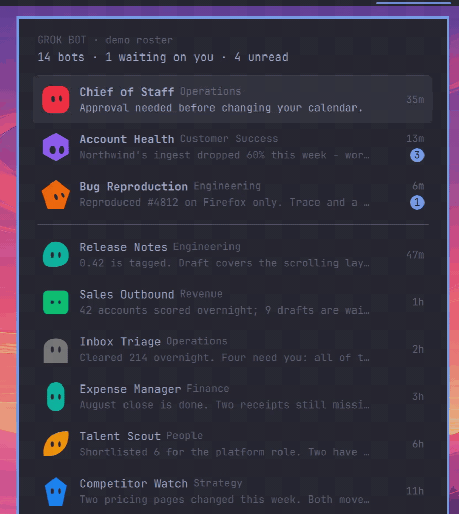
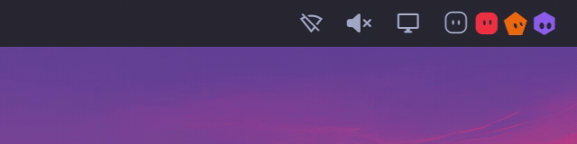

<!--
 ▄█████▄    ▄███████████▄    ▄███████    ▄███████▄    ▄█████▄   ███████████
███   ███  ███   ███   ███  ███   ███  ███   ███   ███   ███      ███
███   ███  ███   ███   ███  ███   ███  ███   ███   ███   ███      ███
███   ███  ███   ███   ███  ███▄▄▄███  ███▄▄▄██▀   ███   ███      ███
███   ███  ███   ███   ███  ███▀▀▀███  ███▀▀▀██▄   ███   ███      ███
███   ███  ███   ███   ███  ███   ███  ███   ███   ███   ███      ███
███   ███  ███   ███   ███  ███   ███  ███  ▄███   ███   ███      ███
 ▀█████▀    ▀█   ███   █▀   ███   █▀    ▀███████▀   ▀█████▀       ███
-->

Your [Grok Bot](https://x.ai/bot) roster in the [Omarchy](https://omarchy.org) bar. Every bot is drawn as itself - the shape and colour it has in the app, or the picture you gave it - wearing the face of whatever it wants from you.

<a href="assets/panel.mp4"></a>

## Install

```sh
omarchy plugin add https://github.com/njpatel/omabot.git --enable
omarchy restart shell
```

Nothing to configure. Omabot reads the state Grok Bot already keeps on disk, so it needs the desktop app and `python3` and nothing else. It never touches the network, and it only ever reads - Grok Bot is left alone.

Remove with `omarchy plugin remove njpatel.omabot`. It leaves behind only `~/.local/state/omarchy/omabot/`, where it keeps a copy of any avatar picture it has had to decode - delete it if you like.

## In the bar

The Grok Bot mark is always there, dimmed when the app is not running. Beside it are the bots waiting on you, drawn as themselves. Nothing beside the mark means nothing needs you.

<a href="assets/assistance-top.mp4"></a>

Bring the pointer near and they look up at you, one after another.

When a bot joins the bar, its neighbours make room before it slides in from the
screen edge, bounces twice and settles. A bot asking for assistance then pauses
and gives one short wiggle. This follows top, bottom, left and right bars; side
bars stack the avatars vertically. A bot already visible as working or unread
lands and wiggles when it needs your input, without opening another slot.
Ordinary state refreshes do not replay the entrance or wiggle.

Watch the arrival from each edge: [top](assets/assistance-top.mp4) ·
[bottom](assets/assistance-bottom.mp4) · [left](assets/assistance-left.mp4) ·
[right](assets/assistance-right.mp4). [Still bar screenshot](assets/bar.png).

These are native 2× Retina captures of the real shell, using invented bots.
The videos retain 60 fps; the inline GIFs use 24–30 fps. Images display at half
their pixel width for Retina sharpness. Crops keep the original pixels, not an
upscaled recording.

Desktop notifications remain Grok Bot's job. Omabot does not send a second set.

| | |
|---|---|
| click | open the panel |
| right-click | jump to Grok Bot |
| middle-click | cycle what sits beside the mark |

## In the panel

Every bot, with its title, its last message, how long ago, and an unread badge. By default the ones waiting on you come first - longest wait at the top, so nobody is buried - then a rule, then everyone else by recency.

<a href="assets/omabot.png"></a>

The avatars greet you when the panel opens, and their eyes follow the pointer while it is over the list.

[Watch the full panel greeting and pointer-following video](assets/panel.mp4).

| key | |
|---|---|
| `j` `k` | move |
| `Enter` | open Grok Bot |
| `g` | cycle the order: waiting first, by channel, or purely by recency |
| `h` | redact names and messages, for sharing a screen |
| `r` | cycle what sits beside the mark |
| `Esc` | close |

## Faces

A bot that wears a picture is drawn with it, masked to the same squircle the app uses, and keeps its picture through every animation. The rest get a face: there is no expression in Grok Bot's data - the app stores a shape, a colour and a pair of eyes - so this is Omabot's reading of what a bot is doing:

| | |
|---|---|
| **eyes up, leaning in** | waiting on your answer |
| **wide-eyed** | more than one unread message |
| **head tilted** | one unread message |
| **half-closed, breathing** | nothing for a week |
| **level** | up to date |

A bot that has been sent a message nobody has answered yet says `thinking…` in place of its last line.

## Settings

Set on the bar entry, or with the keys above:

```sh
omarchy bar set njpatel.omabot barMetric count      # avatars · count · none
omarchy bar set njpatel.omabot ordering channels    # attention · channels · flat
omarchy bar set njpatel.omabot maxBarAvatars 4      # 1-6
```

`omarchy-shell njpatel.omabot demo` swaps in a staged roster - fourteen invented bots across two channels - for screenshots and for showing the thing off. Call it again for the real one.

`omarchy-shell njpatel.omabot demoAssistance` closes the panel and, after one
second, makes the invented Chief of Staff ask for help. Repeat to replay the
space-then-drop animation. During development use
`omalab ipc -n <owned-lab> njpatel.omabot demoAssistance`, never the host shell.

## How it works

Grok Bot keeps its client state in `~/.config/Grok Bot/sand-client-persistence`, as blobs whose filenames are base32 of the state key. `bin/omabot-watch` decodes those, follows the roster, the channels and the session marker, and streams a normalised snapshot as JSON lines; `Widget.qml` renders it, and `Avatar.qml` draws the eighteen shapes and the colour palette taken from the app bundle, so a bot looks the same here as it does there.

None of that is a documented contract. Grok Bot 0.47.0 still writes roster
`schemaVersion` 4; Omabot understands its `purple` palette name, structured
requests for input and `notifyOnUpdatesEnabled` preference, while retaining the
older `violet` name and `notificationsEnabled` fallback. Optional fields are
read defensively. Future app versions are not guaranteed: if an update moves
things, `bin/omabot-watch` is the file to fix.

## License

Apache-2.0
