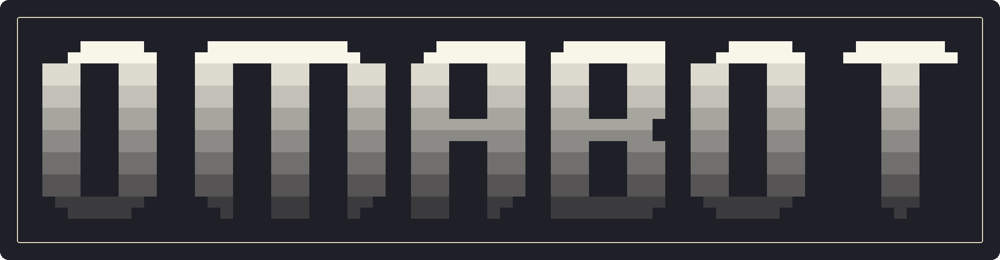
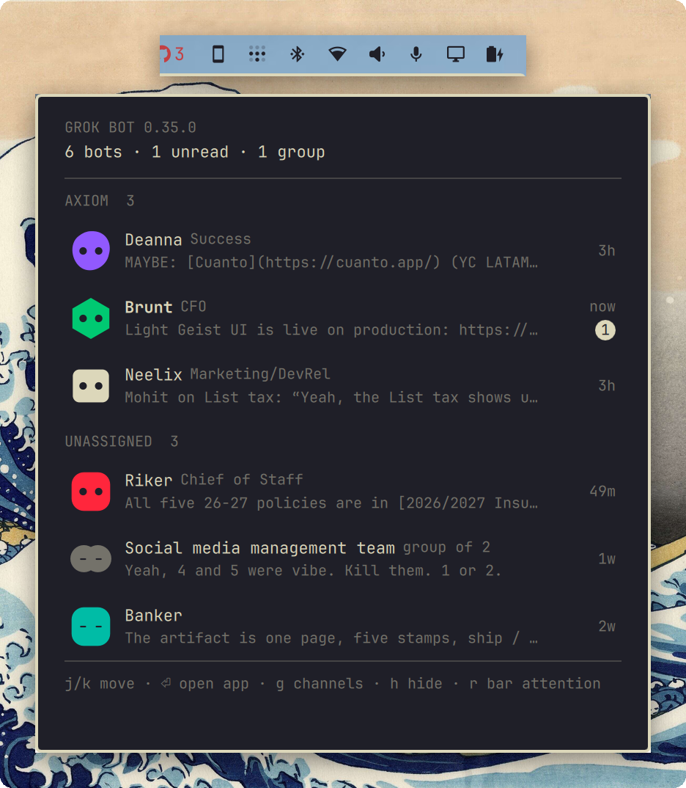

Your [Grok Bot](https://x.ai/bot) roster in the [Omarchy](https://omarchy.org) bar - every bot drawn as its own avatar, with an expression for what it wants.



## Install

```sh
omarchy plugin add https://github.com/njpatel/omabot.git --enable
omarchy restart shell
```

Nothing to configure. Omabot reads the state Grok Bot already keeps on disk; it needs `python3` and the desktop app installed. It never talks to the network, and it only reads - Grok Bot is left alone.

## Use

Bots that want you appear in the bar as themselves: the shape and colour they have in the app, followed by the count of unread messages. Nothing there means nothing needs you. Click to open the panel, or right-click to jump straight to the app.

Expressions carry the state, so you can read the bar out of the corner of your eye:

| | |
|---|---|
| **bobbing, brows up** | waiting on your answer |
| **glancing sideways** | unread messages |
| **blinking** | up to date |
| **asleep** | nothing for a week |

The panel lists every bot, grouped by the channels you set up in Grok Bot, with its title, last message, how long ago, and an unread badge.

| key | |
|---|---|
| `j` `k` | move |
| `Enter` / click | open Grok Bot |
| `g` | group by channel / flat, most urgent first |
| `h` | redact names and messages |
| `r` | cycle what the bar shows: attention, all, count, none |

Settings live on the bar entry: `omarchy bar set njpatel.omabot barMetric count` (or `groupBySection`, `maxBarAvatars`).

## How it works

Grok Bot stores its client state in `~/.config/Grok Bot/sand-client-persistence`, as blobs whose filenames are base32 of the state key. `bin/omabot-watch` decodes those, follows the roster, the sidebar sections and the session marker, and streams a normalised snapshot as JSON lines; `Widget.qml` renders it, and `Avatar.qml` draws the 18 shapes and the colour palette taken from the app bundle so a bot looks the same here as it does there.

None of that is a documented contract - the roster is at `schemaVersion` 4 - so every field is read defensively and an unfamiliar shape degrades to an empty roster rather than a broken bar. If a Grok Bot update moves things, this is the file to fix.

## License

Apache-2.0
